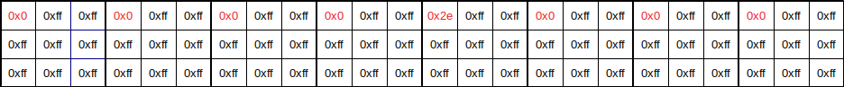

# Convolution
The service allows users to upload images and get back the time it took the service to to do kernel filtering (convolution) of these images. Part of the service is written in a custom vector assembler, similar to ISA of modern GPUs.

## Functionality

### GET /list
Gets a list of IDs of convolution kernels parameters. The response is a plain text with the IDs:
```
jpci-7xfh-fkgi
nwd2-6iem-wfwa
4kmf-2dli-mn58
5r83-xjla-5j7c
vsvp-937r-lo3e
rpon-qspu-cy9u
52cv-vu95-tghm
6h4t-dl16-bkuj
q78m-za9z-m71s
09lw-ykdo-3zqp
```

### POST /process?kernel-id=\<id of kernel parameters\>
Puts the image (or images) to process with specified convolution kernel parameters. It might contain one or more images. The response is a JSON which contains times it took the service to process every channel of every image. Here is an example of the response for a request to process three images:
```
{
    "3GYZGTI9NCHYMF1LYC1LQ9FRGLX6R20T": {
        "red_channel": 76836,
        "green_channel": 75710,
        "blue_channel": 74550,
        "alpha_channel": 71770
    },
    "RO450VSGGNUHH9JKZGL3YKDFXO14CN1L": {
        "red_channel": 502162,
        "green_channel": 453734,
        "blue_channel": 448513,
        "alpha_channel": 433320
    },
    "SXONRIYPYM1ZR7L461D51UR4VSM4M6X0": {
        "red_channel": 62356,
        "green_channel": 61912,
        "blue_channel": 60816,
        "alpha_channel": 58642
    }
}
```
If ID of the convolution kernel parameters is signed (the signature is expected in HTTP headers), the service saves processed images on disk.

### GET /get-image?name=\<image name\>
Gets processed and saved image from disk. Image name must be signed, the signature is expected in HTTP headers. This endpoint is needed to verify the correct functioning of the service. It is not available for the teams because it is possible to restore convolution kernel parameters, i.e flag, from the processed image.

### POST /add-kernel?kernel-id=\<id of kernel parameters\>&kernel=\<kernel parameters\>
Adds new convolution kernel parameters. ID is a string, maximum length is 32. Convolution kernel parameters is a string which must be exactly 32 bytes long. ID must be signed (the signature is expected in HTTP headers). The checker uses this endpoint to post flags as convolution kernel parameters. Example:
```
http://somehost.com/add-kernel?kernel-id=R98PQO4U&kernel=MUUOOOKGPYQCGGVHKTLUCGOQCEULRDL=
```

### GET /get-kernel?kernel-id=\<id of kernel parameters\>
Gets convolution kernel parameters by ID. ID must be signed, the signature is expected in HTTP headers. Response is a plain text which contains convolution kernel paramaters.

### Note
Putting/getting convolution kernel parameters, and getting resulting images is only allowed for those who provide a valid digital signature. Only the checker has the private key, so these endpoints are restricted to the checker.

## Convolution
Convolution takes 3x3 pixels blocks from the source image and combines them into one pixel of the destination image. Convolution is applied to every channel separately. There is only one convolution kernel, but it has 32 parameters, each parameter is one byte long.

Here is a 3x3 block of the source image with pixels indexed from 0 to 31:


Kernel formula is:


where 'c' is the channel index(0 - red, 1 - green, 2 - blue, 3 - alpha), 'p' - pixel value (0..255), 'k' - kernel parameter.

## Vector assembler
The convolution is performed by a program written in custom assembler. It is similar to AMD GPU ISA. Compiled programs written in this assembler are called kernels, not to be confused with the convolution kernel. Each vector register has 8 lanes because vector instructions and registers are implemented by using AVX2 and SSE4. As in modern GPUs some of the lanes may be deactivated during execution because of the flow control instructions. The compiler generates two variants of the code: AVX2 variant and SSE4 variant. On the kernel startup all of 8 lanes are active and the AVX2 variant is used, but when the last 4 lanes are inactive the flow control switches to the SSE4 variant.

### Vuln
To take advantage of vectorization, the kernel program that performs a convolution loads data in vector register as follows:


Where `Vx_y` is a vector register, `x` is a register index (v0, v1, v2 etc), `y` is a lane index. One kernel execution performs convolution of eight 3x3 blocks, that's why the source image width must be a multiple of 24 and the height must be a multiple of 3.

Teams are not allowed to downloaded processed images, but there is a side channel - teams can post specially crafted images and restore kernel parameters (i.e. the flag) by analyzing the execution times. This happens because switches between AVX2 and SSE4 variants of code are expensive because of the `xsave` x86 instruction.

A naive way to steal 0th character of flag is to prepare 39 images for each possible symbol of the alphabet as follows:

Image for `.`:


Image for `0`:


Image for `1`:

and so on to `9`.

Image for `=`:


Image for `A`:


Image for `B`:

and so on to `Z`.

Image for `_`:


The next step is to submit them all to process. After you get back the timings you need to look at the timings for the red channel. Let's say you got this timings:

| Char  |  Time  |
| ----- | ------ |
| `.` | 138088 |
| `0` | 130454 |
| `1` | 129942 |
| `2` | 129706 |
| `3` | 129626 |
| `4` | 129733 |
| `5` | 129659 |
| `6` | 129760 |
| `7` | 129799 |
| `8` | 129785 |
| `9` | 129635 |
| `=` | 135234 |
| `A` | 130276 |
| `B` | 129675 |
| `C` | 129760 |
| `D` | 129825 |
| `E` | 129686 |
| `F` | 129990 |
| `G` | 130020 |
| `H` | 129705 |
| `I` | 130046 |
| `J` | 129681 |
| `K` | 131270 |
| `L` | 129686 |
| `M` | 130331 |
| `N` | 129992 |
| `O` | 129788 |
| `P` | 130114 |
| `Q` | 129955 |
| `R` | 129990 |
| `S` | 129806 |
| `T` | 130039 |
| `U` | 129615 |
| `V` | 97530  |
| `W` | 97604  |
| `X` | 97468  |
| `Y` | 97480  |
| `Z` | 97675  |
| `_` | 97639  |

As you can see, there is a drop between 'U' and 'V' symbols, that means that the first symbol of flag is 'V'.

Why so?
Here is an example of how the 2nd pixel in each block is processed (the processing is similar for other pixels as well):
```
# load address of kernel parameters
0 s_load s1q, 16, s0q
# load 8 bytes of kernel parameters
1 s_load s1q, 0, s1q
# because we process the 2nd byte shift left by 16
2 s_shr s1q, s1q, 16
# ... and leave only byte, so s1q contains exact only one 2nd parameter
3 s_and s1q, s1q, 0xff
# move kernel parameter to vector register
4 v_mov v11, s1
# compare with pixel value
5 v_cmp_eq_u32 v2, v11
6 s_mov s2, vcc
7 v_cmp_gt_u32 v2, v11
8 s_or exec, s2, vcc
# if condition evaluated to true, perform calculations below
9 v_add_u32 v12, v12, v2
10 v_add_f32 v13, v13, 1.0
# restore exec register
11 s_mov exec, 0xff
```
The transition between AVX2 and SSE4, and therefore a penalty, may happen in the 8th line if the last 4 bits of the exec register are zeroes and then another penalty happens in the 11th line.

We set each pixel of eight 3x3 blocks to `0xff` (except the 0th pixel of each block), that means that the condition  is true for all lanes because any character in the flag is less that 0xff, so all lanes will be active and there will be no transitions between AVX2 and SSE4 variants. The 0th pixel of 0th, 1st, 2nd, 3rd, 5th, 6th and 7th block we set to `0x00`, that means that the condition  is false for 0th, 1st, 2nd, 3rd, 5th, 6th and 7th lanes. The key is the 4th block, if the condition is true, the `exec` mask equals `0b00001000` and AVX2 variant is used, otherwise the `exec` mask equals `0b00000000` and the switch to SSE4 variant happens, causing time penalty.

The next step is to repeat all this for the remaining 31 bytes of kernel parameters, the only difference is that you need to select a different pixel and a different channel:

| Byte index | Pixel index in block | Channel |
|---|---|-----|
| 0 | 0 | red |
| 1 | 1 | red |
| 2 | 2 | red |
| 3 | 3 | red |
| 4 | 4 | red |
| 5 | 5 | red |
| 6 | 6 | red |
| 7 | 7 | red |
| 8 | 0 | green |
| 9 | 1 | green |
| 10 | 2 | green |
| 11 | 3 | green |
| 12 | 4 | green |
| 13 | 5 | green |
| 14 | 6 | green |
| 15 | 7 | green |
| 16 | 0 | blue |
| 17 | 1 | blue |
| 18 | 2 | blue |
| 19 | 3 | blue |
| 20 | 4 | blue |
| 21 | 5 | blue |
| 22 | 6 | blue |
| 23 | 7 | blue |
| 24 | 0 | alpha |
| 25 | 1 | alpha |
| 26 | 2 | alpha |
| 27 | 3 | alpha |
| 28 | 4 | alpha |
| 29 | 5 | alpha |
| 30 | 6 | alpha |
| 31 | 7 | alpha |

To level out the impact of randomness on timings, you can submit images that repeat the same 24x3 pixels block multiple times. This is equivalent to submitting the same image over and over, but all in one request.

You can also speed up the search for the drop in timings by using a binary search.

### Fixing
Remove xsave instruction between AVX2 and SSE4 switches.

## Note
Tested only on Intel Coffee Lake Processors.
