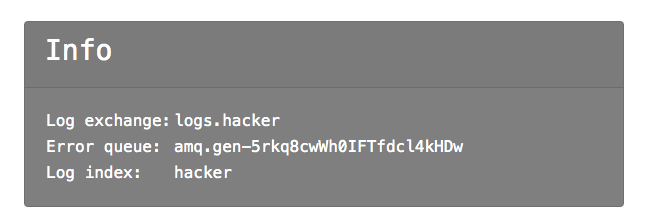
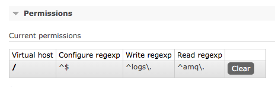
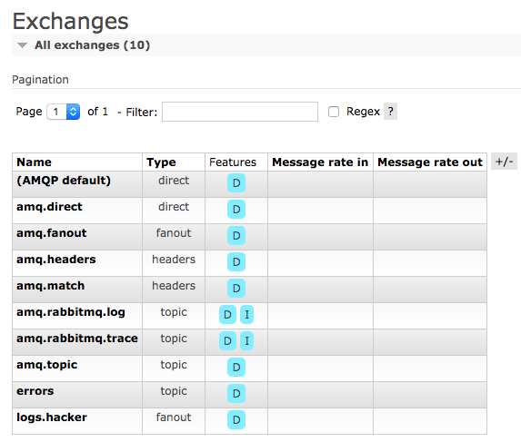

# Deer Service

The service emulates quite common production [ELK](https://www.elastic.co/what-is/elk-stack) setup ([example](https://medium.com/@anderskmadsen/elk-and-rabbitmq-in-docker-44c6fd501015)):


Checker performs the Logstash Provider role. And the Deer application performs the Logstash Consumer role.

The service has 3 entry points:

* Web application, listens on port 5000 and allows to create new users. For each new user a user with same credentials is created in RabbitMQ and Elasticsearch. In this web application the user can see a RabbitMQ exchange to write logs, RabbitMQ queue to get errors and Elasticsearch index name to search on written logs:
  
* RabbitMQ, listens on port 5672
* Elasticsearch, listens on port 9200

The checker creates new users in web application, writes logs via RabbitMQ and search on indexed logs in Elasticsearch. Flags are stored in indexed logs and sometimes in usernames.

# Known Vulns

## Access to `amq.rabbitmq.log`

When new RabbitMQ user is created the following permissions are set:


This allows user to publish messages to exchange `logs.<user>` and to consume messages from queue `amq.gen-...` (`amq.gen-r9CSbKRr4awsxv6VtfT9YQ` for example).

The first bug is in user permissions.

There is a build-in exchange `amq.rabbitmq.log` ([exchange description](https://www.rabbitmq.com/event-exchange.html)):


A lot of internal RabbitMQ events (`user created` for example) are published to this exchange. User lacks of `configure` permission that's why he can't directly bind this exchange to his error queue. But he can bind `amq.rabbitmq.log` to `logs.<user>` exchange: `exchange.bind` requires write permission on destination exchange and read permission on source exchange ([Authorisation: How Permissions Work](https://www.rabbitmq.com/access-control.html#authorisation)).

Attack scenario:
1. Hacker create new user
2. Hacker bind `amq.rabbitmq.log` exchange to log exchange (`logs.<user>`)
3. Internal events start to publish to `logs.<user>`:
   ```
   Creating user 'qqq10'

   Setting user tags for user 'qqq10' to []

   Setting permissions for 'qqq10' in '/' to '^$', '^logs\.', '^amq\.'

   accepting AMQP connection <0.1091.0> (172.18.0.5:43015 -> 172.18.0.3:5672)

   Connection <0.1091.0> (172.18.0.5:43015 -> 172.18.0.3:5672) has a client-provided name: Deer.dll

   connection <0.1091.0> (172.18.0.5:43015 -> 172.18.0.3:5672 - Deer.dll): user 'admin' authenticated and granted access to vhost '/'
   ```
4. Deer service tries to consume it but can't parse
5. It publishes error event containing the original event to user error exchange
6. Hacker consumes his error exchange and get internal RabbitMQ events with flags.

The full exploit can be found at [/sploits/deer/deer.sploit.rmq.py](../../sploits/deer/deer.sploit.rmq.py). 20% of flags can be stolen by this vulnerability.

## RCE via .NET deserialization

The service is written in .NET Core. It uses [EasyNetQ](http://easynetq.com/) - a very popular (3,844,883 total downloads in [NuGet](https://www.nuget.org/packages/EasyNetQ/)) library to work with RabbitMQ. This library uses Json.NET internally with unsafe `TypeNameHandling` setting ([EasyNetQ GitHub](https://github.com/EasyNetQ/EasyNetQ/blob/88c12ea70074e5693e38e21a0a92d2d9a344ddf4/Source/EasyNetQ/JsonSerializer.cs#L15)):
```csharp
public JsonSerializer()
{
    serializerSettings = new JsonSerializerSettings
    {
        TypeNameHandling = TypeNameHandling.Auto
    };
}
```

The first challenge for teams is to find that this third-party library is vulnerable to .NET deserialization vulnerability. This part is quite easy.

The main challenge is to exploit this vulnerability. There are no known suitable deserialization RCE gadgets for .NET Core (see [ysoserial.net](https://github.com/pwntester/ysoserial.net) for example).

But the service provides everything needed (imperceptibly, of course). :-)

First of all, the service uses another very popular (9,469,558 total downloads in [NuGet](https://www.nuget.org/packages/Hangfire.Core/)) third-party library to shedule recurring jobs - [Hangfire](https://www.hangfire.io/). The service uses [Hangfire.MemoryStorage](https://github.com/perrich/Hangfire.MemoryStorage) as a job storage for Hangfire.

The main idea to get a RCE is to create a Hangfire server with specially crafted memory storage. But there are a lot of obstacles that teams will have to overcome. :-)

Teams will have to create [Data](https://github.com/perrich/Hangfire.MemoryStorage/blob/05984ae16685e1f4483858edecfed98f2c9deb54/src/Hangfire.MemoryStorage/Database/Data.cs#L10) object to fill jobs data. By default `JsonSerializerSettings` configured to deserialize only `public` object fields, that's why EasyNetQ `JsonSerializerSettings` does not allow to do it. Teams have to find [SafeJsonDeserializer.cs](../../services/deer/src/Deer/Models/Elasticsearch/SafeJsonDeserializer.cs) which takes `JsonSerializerSettings` as an argument:
```csharp
public SafeJsonDeserializer(string json, JsonSerializerSettings settings)
{
    try
    {
        Model = JsonConvert.DeserializeObject<T>(json, settings);
    }
    catch (Exception e)
    {
        Error = e;
    }
}
```

Via `SafeJsonDeserializer` teams can use the deserialization vulnerability in EasyNetQ to create a even more vulnerable JsonSerializerSettings (which can set private fields for example). And to get a RCE as a result.

The full exploit can be found at [/sploits/deer/Deer.Sploit.RCE](../../sploits/deer/Deer.Sploit.RCE/Program.cs). All flags can be stolen by this vulnerability.
