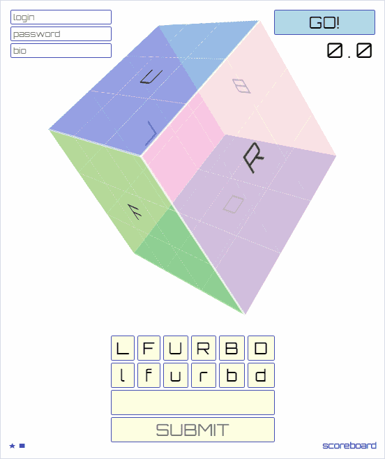
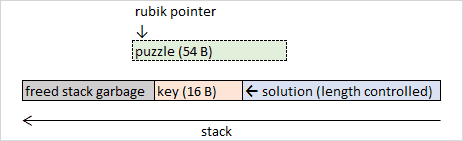
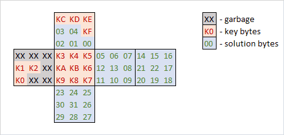
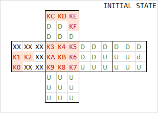
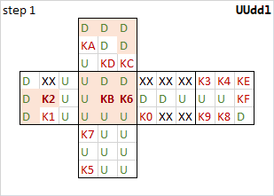
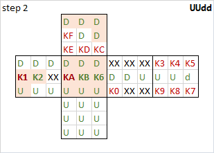
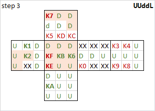
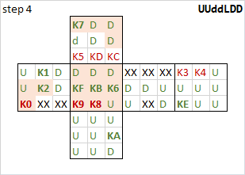
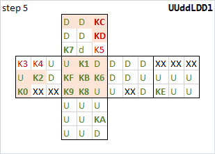
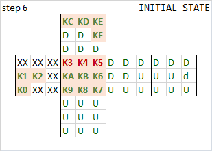

# rubik

A web service for online Rubik's cube puzzle. Users can solve generated puzzles and see their own and others' results.



HTTP API consists of 4 handlers:
* `/api/auth` — get current user auth info including a private bio field;
* `/api/generate` — generate a new shuffled puzzle, response contains a puzzle for javascript UI and a serialized + HMAC'ed binary representation of a puzzle;
* `/api/solve` — POST the puzzle obtained from `/api/generate` and the solution to store the result and possibly set auth cookie;
* `/api/scoreboard` — get latest solutions.

User can set no auth info and solve puzzles as a guest. If some info about the user is provided, the server sets `AUTH` cookie and subsequent solution submissions use this cookie to get the username and include it into solution results info. This cookie can be used to get info about user with `/api/auth`.

## Vulns
### 1. Stackalloc'ed buffer use-after-free

The stackalloc operator allocates a block of memory on the stack. The reason to use stackalloc is performance: fast allocation and deallocation, locality of the data, less GC pressure, and automatic cleanup: when the method ends, the stack gets unwinded together with its memory.

This cool new feature is used in the rubik service. The size of the stack is relatively small, hence there's a helper function to allocate small buffers on the stack and the larger ones on the heap:
```f#
let inline stackalloc<'a when 'a: unmanaged> size =
    let ptr = NativePtr.stackalloc<'a> size |> NativePtr.toVoidPtr
    Span<'a>(ptr, size)
    
let inline alloc<'a when 'a: unmanaged> size =
    if size < Small then stackalloc<'a>(size) else Span<'a>(Array.zeroCreate<'a>(size))
```

If the `size` is less than `Small` (100 bytes) the buffer will be allocated on the stack.
`Span<T>` is a simple value type that provides a type-safe and memory-safe way to work with any kind of continuous memory region. It contains a pointer to this region.

The vuln is in the `TryDeserialize` method which returns a `Rubik` instance created from a `Span<byte>` buffer that could be allocated on the stack. As a result, a pointer to the stack region is stored in an object:
```f#
static member public TryDeserialize(value: string, key: Guid) =
    let mutable data = alloc<byte>(length)
    ...
    | ... -> new Rubik(Raw = data.Slice(sizeof<UInt16> + sizeof<UInt64> + sizeof<Guid>))
```

When the method exits, the stack region will be freed, but the saved memory pointer will remain in the `Rubik` object and will be used in subsequent actions with it.

### 2. Weakness of generated cube HMAC validation

A generated puzzle is HMAC'ed with the key and is serialized into an array of bytes without any delimiters or field lengths. The serialized and HMAC'ed puzzle is normally exactly 100 bytes long, thus it will be allocated on the heap.

But a close inspection of the [deserialization method](https://github.com/HackerDom/proctf-2019/blob/master/services/rubik/rubik/RubikHelper.fs#L42) reveals that the puzzle itself is read from the beginning of the array, while the authentication code is read from the end. Therefore, if we manage to find such a puzzle that its tail bytes are equal to the starting bytes of the calculated authentication code, we will be able to reduce the size of the serialized puzzle by overlapping the puzzle and the authentication code.

Fortunately, since the default length of the serialized puzzle is 100, we only need a one-byte overlap to get it onto the stack. We still need to brute force to get a puzzle with its tail byte matching the first byte of the authentication code, but this brute forcing is feasible.

### Exploiting
Once the `Rubik` instance is deserialized and contains a pointer to freed stack memory, there are two other buffers [allocated](https://github.com/HackerDom/proctf-2019/blob/master/services/rubik/rubik/SolveHandler.fs#L51) on the stack: the first one is to store the `solution` — an array of cube rotations, and the other one is to store a `key` — a copy of the global key that is used to encrypt auth cookies.

```f#
match RubikHelper.TryDeserialize(puzzle, SettingsManager.Current.Key) with
| rubik ->
    let moves = stackalloc<Rotation>(solution.Length)
    match SolveHandler.TryGetMoves(solution, moves) with
    | true ->
        let key = stackalloc<byte>(SettingsManager.Current.KeySize)
        SettingsManager.Current.Key.TryWriteBytes(key) |> ignore

            rubik.Turn(moves)
```

At this point the memory on the stack looks roughly like this:



By changing the length of the solution we can ensure that the memory regions of `rubik` and `key` overlap. It is necessary to take into account the alignment of memory regions. In addition, JIT can optimize the compiled code that is used frequently, so the `key` offset relative to the `rubik` may change after several requests to the server.
You can try to determine `key` offset by checking the HTTP status code of `/api/auth` request. Or you can modify your own service to see relative offsets in memory:
https://github.com/HackerDom/proctf-2019/blob/master/services/rubik/rubik/SolveHandler.fs#L60

The simplest way to determine the right length of the `solution` is to debug the service and take note of the positions of the `rubik` and the `key`.

Once the `key` and the `rubik` are aligned, the `rubik` object will represent a puzzle that looks like this:



The service then rotates the puzzle in accordance with the `solution` (the array of rotations provided by the user). The server response doesn't contain the resulting puzzle or its parts, so we can't extract the key bytes directly. But we can change arbitrary key bytes by rotating the puzzle.

The idea is to leave a small (1..3) number of key bytes unknown, and change the rest of the key bytes by swapping them with the bytes of the solution. After that, we receive a cookie encrypted with this mangled key, and we know most of its bytes and we can bruteforce the remaining bytes until we get a match with a known plaintext. That way we can reveal a part of the actual key.

We can then repeat this process by providing more solutions to reveal more parts of the original key, until we completely recover the original key.

There's an additional complication, however: the rotation of the cube will mangle not only the key bytes but also the solution bytes, and the mangled solution bytes will then be used for next rotations, so if we are not careful, the solution process will be unstable and will result in a key that is unpredictably mangled.

Therefore, it is necessary to determine a safe solution prefix that will provide an invariant: at each rotation the corresponding byte of the solution isn't corrupted by an unknown byte. One of such safe `solution` prefixes that doesn't change the position of the facelets of the cube is `DDDDDDDDUUUUDDDDDdUUUUUUUUUUUUUUUU`.



Next, we need to create a `solution` infix to align the key to the desired offset, it is convenient if then infix doesn't change the position of the facelets of the cube. For example: `DDDD UUUU ...` or `Ll Ff Uu ...`.

Finally we need to come up with a suffix that allows us to bruteforce the key by 1..3 bytes. Below you can see one of the possible variants of rotations:








Using the reconstructed key we can forge cookies for other users and get flags by calling the `/api/auth` method. See the exploit [here](https://github.com/HackerDom/proctf-2019/blob/master/sploits/rubik/src/Program.cs).
